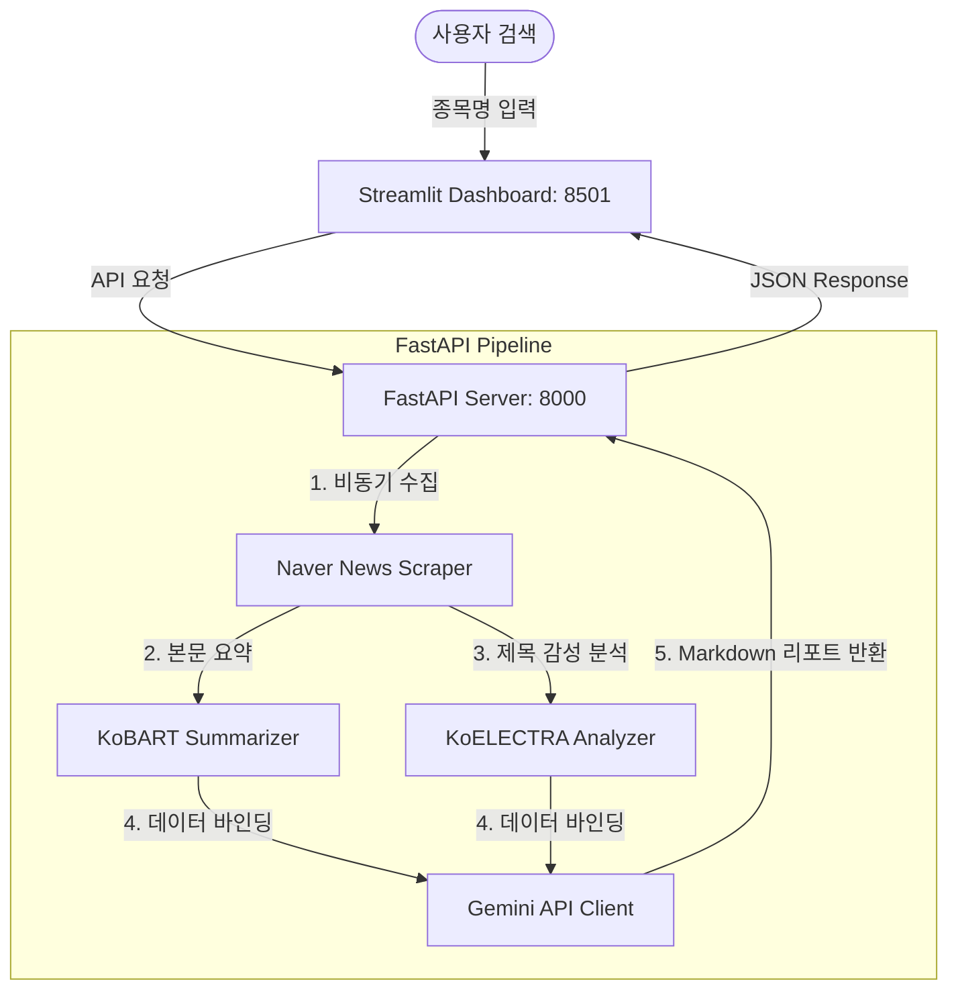

# Stock Sentiment Assistant

실시간 뉴스 크롤링, 감성 분석(Sentiment Analysis), 그리고 생성형 AI 요약을 결합하여 주식 투자 보조 지표를 제공하는 엔드투엔드 대시보드 애플리케이션입니다.

로컬 딥러닝 모델(KoELECTRA, KoBART)과 클라우드 LLM(Gemini API)을 유기적으로 결합하여 빠르고 경제적인 분석 파이프라인을 구축했습니다.

---

## 🛠️ Tech Stack & Architecture

### Backend & AI Models
- **FastAPI**: REST API 서버 구축 및 비동기 파이프라인 제어
- **KoELECTRA (Base v3)**: 한국어 금융 뉴스 특화 감성 분류 모델 (긍정/중립/부정 3-Class)
- **KoBART (Summarization)**: 뉴스 본문 추상 요약 모델 (최대 3줄 제한 후처리 적용)
- **Gemini API (gemini-2.5-flash)**: 감성 스코어 및 뉴스 요약을 기반으로 종합 투자 분석 리포트 생성
- **BeautifulSoup4 & httpx**: 네이버 뉴스 실시간 비동기 크롤러

### Frontend
- **Streamlit**: 실시간 감성 분석 통계 시각화 및 AI 보고서 뷰어 대시보드

### Data Flow


---

## 📂 Project Structure

```text
stock_sentiment_project/
├── backend/
│   ├── api/
│   │   └── main.py          # FastAPI 라우터 및 모델 싱글톤 수명 주기 관리
│   ├── core/
│   │   ├── scraper.py       # 네이버 뉴스 비동기 크롤러
│   │   └── preprocessor.py  # 정규식 기반 뉴스 텍스트 클리너
│   └── models/
│       ├── sentiment.py     # KoELECTRA 감성 분석 추론 모듈
│       ├── summarizer.py    # KoBART 3줄 요약 추론 모듈
│       └── gemini_client.py # Gemini API 투자 분석 보고서 생성기
├── frontend/
│   └── app.py               # Streamlit 대시보드 프론트엔드
├── data/
│   ├── finance_data.csv     # 한국어 금융 뉴스 감성 데이터셋 (4,846문장)
│   └── model_save/          # 파인튜닝된 KoELECTRA-Base 가중치 저장소
├── requirements.txt         # 의존성 패키지 명세
└── train_colab.py           # Google Colab A100 전용 학습 스크립트
```

---

## 🚀 Getting Started

### 1. 가상환경 구축 및 패키지 설치
```bash
# 가상환경 활성화 (Windows)
.venv\Scripts\Activate.ps1

# 패키지 의존성 설치
pip install -r requirements.txt
```

### 2. 환경변수 설정 (Gemini API Key)
보고서 생성을 위해 Gemini API 키가 환경변수로 등록되어 있어야 합니다.
```powershell
# Windows PowerShell
$env:GEMINI_API_KEY="your_api_key_here"

# Linux / macOS
export GEMINI_API_KEY="your_api_key_here"
```

### 3. 서버 실행

대시보드 구동을 위해 백엔드와 프론트엔드를 각각 다른 터미널 세션에서 띄워줍니다.

#### 백엔드 FastAPI 서버 기동 (Port: 8000)
```bash
python -m uvicorn backend.api.main:app --reload --port 8000
```
*서버 기동 시 KoELECTRA 및 KoBART 가중치를 메모리에 1회 싱글톤 로딩하므로 기동에 약 5~15초 소요됩니다.*

#### 프론트엔드 Streamlit 웹 앱 기동 (Port: 8501)
```bash
streamlit run frontend/app.py
```
실행 후 브라우저에서 `http://localhost:8501`에 접속하여 주식을 검색합니다.

---

## 📊 Model Training & Evaluation

소수 클래스(부정 레이블 12.4%) 편향 극복을 위해 `WeightedRandomSampler`를 적용하여 `KoELECTRA-Base-v3`를 Full Fine-tuning 했습니다.

### Evaluation Metrics
- **Dataset**: Financial PhraseBank 한국어 검수 버전 (4,846 문장)
- **Validation Macro F1-Score**: **`0.8416`** (최종 채택)

### Hyperparameters
| Parameter | Value |
| :--- | :--- |
| Base Model | `monologg/koelectra-base-v3-discriminator` |
| Batch Size | 32 (A100) |
| Learning Rate | `2e-5` (Weight Decay: 0.01) |
| Regularization | Label Smoothing (0.1) |
| Early Stopping | Patience = 3 (Actual Epoch = 10) |
| Optimizer | AdamW |
