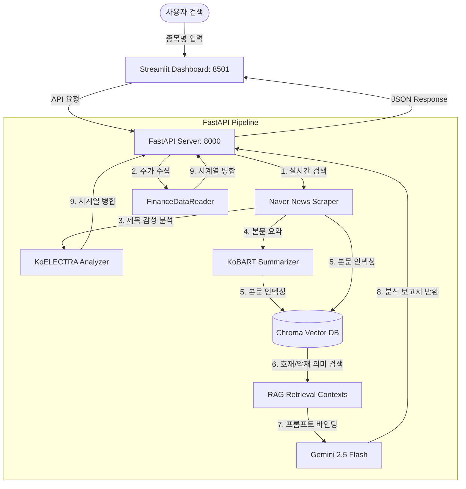

# Stock Sentiment Assistant

실시간 금융 뉴스 크롤링, 로컬 모델 기반 감성 분석(KoELECTRA) 및 본문 요약(KoBART), 그리고 로컬 벡터 DB RAG(ChromaDB)를 연동한 Gemini AI 투자 보고서 자동화 대시보드 플랫폼입니다.

국내 금융 포털 서버로부터 안정적으로 초고속 주가 시계열을 수집하며, 검색된 호재/악재 뉴스 컨텍스트를 LLM 프롬프트에 주입(RAG)함으로써 리포트의 할루시네이션(환각)을 억제하고 신뢰도를 보장합니다.

---

## 🛠️ Tech Stack & Architecture

### Backend & AI Pipelines
- **FastAPI**: 비동기 API 서빙 및 백엔드 파이프라인 오케스트레이션
- **KoELECTRA-Base-v3**: 한국어 금융 뉴스 제목 특화 감성 분류 모델 (긍정/중립/부정 3-Class Fine-tuned)
- **KoBART-Summarization**: 뉴스 본문 추상 요약 모델 (로컬 추론)
- **ChromaDB & SentenceTransformer**: 로컬 임베딩(`ko-sroberta-multitask`) 기반 벡터 DB 구축 및 의미론적 문맥 검색(RAG) 지원
- **FinanceDataReader**: 네이버 금융 기반 실시간 한국 주식 시세 데이터 연동
- **Gemini API (gemini-2.5-flash)**: RAG 검색 문맥 바인딩 및 4096 토큰 확장 리포트 생성

### Frontend
- **Streamlit**: 데이터 시각화 및 마크다운 리포트 렌더링 대시보드
- **Plotly**: 주가 종가(Line) 및 일별 평균 뉴스 감성 지수(Bar) 이중 축 시계열 시각화

### Data Flow


---

## 📂 Project Structure

```text
stock_sentiment_project/
├── backend/
│   ├── api/
│   │   └── main.py          # FastAPI 라우터 및 모델 싱글톤 수명 주기 관리
│   ├── core/
│   │   ├── scraper.py       # 네이버 뉴스 비동기 크롤러
│   │   ├── preprocessor.py  # 정규식 기반 뉴스 텍스트 전처리 엔진
│   │   ├── stock_data.py    # FDR 주가 수집 및 주가-감성 시계열 병합 모듈
│   │   └── rag_service.py   # ChromaDB/SBERT 로컬 RAG 파이프라인 서비스
│   └── models/
│       ├── sentiment.py     # KoELECTRA 감성 분류 추론 모델 (절대경로 탐색 적용)
│       ├── summarizer.py    # KoBART 3줄 요약 추론 모듈
│       └── gemini_client.py # RAG 연동 및 토큰 상향 적용 Gemini 리포트 클라이언트
├── frontend/
│   └── app.py               # Streamlit 대시보드 프론트엔드 (Plotly 연동)
├── data/
│   ├── finance_data.csv     # 한국어 금융 뉴스 감성 데이터셋 (4,846문장)
│   ├── model_save/          # 파인튜닝된 KoELECTRA-Base 가중치 저장소
│   └── chromadb/            # RAG 영속 데이터를 보관하는 로컬 벡터 DB 폴더
├── requirements.txt         # 의존성 패키지 명세 (finance-datareader, chromadb 포함)
└── train_sentiment.py       # KoELECTRA 파인튜닝 학습 통합 스크립트
```

---

## 🚀 Getting Started

### 1. 가상환경 활성화 및 패키지 설치
```bash
# 가상환경 활성화 (Windows)
.venv\Scripts\Activate.ps1

# 의존성 패키지 설치
pip install -r requirements.txt
```

### 2. Gemini API 키 환경변수 설정
보고서 생성을 위해 Gemini API 키가 환경변수로 등록되어 있어야 합니다.
```powershell
# Windows PowerShell
$env:GEMINI_API_KEY="your_api_key_here"

# Linux / macOS
export GEMINI_API_KEY="your_api_key_here"
```

### 3. 서버 및 대시보드 구동
데이터 분석 파이프라인 작동을 위해 백엔드 API와 프론트엔드를 각각 다른 터미널 세션에서 띄워줍니다.

#### FastAPI 백엔드 서버 기동 (Port: 8000)
```bash
python -m uvicorn backend.api.main:app --reload --port 8000
```
*서버 가동 시 KoELECTRA 및 KoBART 가중치를 메모리에 1회 싱글톤 로딩하므로 기동에 약 5~15초 소요됩니다.*

#### Streamlit 프론트엔드 기동 (Port: 8501)
```bash
streamlit run frontend/app.py
```
실행 완료 후 브라우저에서 `http://localhost:8501`에 접속하여 주식을 검색합니다.

---

## 📊 Model Training & Evaluation (KoELECTRA)

소수 클래스(부정 레이블 12.4%) 편향 극복을 위해 `WeightedRandomSampler`를 적용하여 `KoELECTRA-Base-v3`를 Full Fine-tuning 했습니다.

### Evaluation Metrics
- **Dataset**: Financial PhraseBank 한국어 검수 버전 (4,846 문장)
- **Validation Macro F1-Score**: **`0.8416`** (최종 채택)

### Hyperparameters
| Parameter | Value |
| :--- | :--- |
| Base Model | `monologg/koelectra-base-v3-discriminator` |
| Batch Size | 32 (A100) |
| Learning Rate | `2e-5` (Weight Decay: 0.01) |
| Regularization | Label Smoothing (0.1) |
| Early Stopping | Patience = 3 (Actual Epoch = 10) |
| Optimizer | AdamW |
